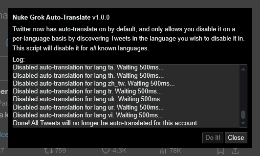

# Nuke Grok Auto-Translate
Twitter now has auto-translate on by default, and only allows you disable it on a
per-language basis by discovering Tweets in the language you wish to disable it in.
This script will disable it for *all* known languages.

## How to use

1. Save the .js file from [the latest release](https://github.com/aubymori/nuke_grok_auto_translate/releases/latest).
2. Open it in Notepad or any other text editor, and copy the contents to your clipboard.
3. On the Twitter homepage, open DevTools (F12 or Ctrl+Shift+I) and select the Console tab.
4. Paste the contents of the script into console.
   - If this is your first time pasting there, you will most likely need to
     type `allow pasting` and press Enter first.
5. Press enter. The script's UI will show up and you will be able to disable auto-translate for all languages.